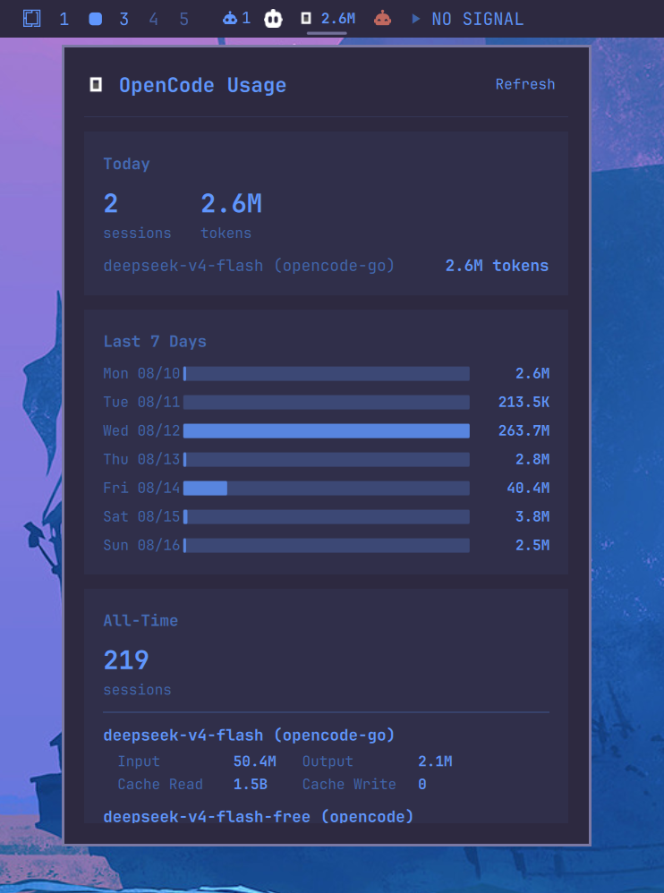

# dizziee.opencode-model-usage

OpenCode token usage stats in the Omarchy bar. Displays today, weekly, and all-time token counts per model.

## Requirements

- Python 3
- OpenCode (offical) https://github.com/anomalyco/opencode
  - Arch: $`pacman -S opencode`
- OpenCode with existing session data in `~/.local/share/opencode/opencode.db`

## Installation

```sh
omarchy plugin add https://github.com/JJDizz1L/dizziee.opencode-model-usage.git --enable
```

### Then place it in your bar layout with 
`omarchy bar plugin add dizziee.opencode-model-usage [--section <left|center|right>]`</br>

Suggested placement: 
```
omarchy bar plugin add dizziee.opencode-model-usage --section left
```

You can validate the plugin at any time with:

```sh
omarchy plugin validate ~/.config/omarchy/plugins/dizziee.opencode-model-usage
```

## Configuration
Configuration lives in `~/.config/omarchy/shell.json`.

| Key | Type | Default | Description |
|---|---|---|---|
| `refreshIntervalSec` | integer (30–3600) | 300 | How often to re-query the OpenCode database (seconds) |

## Preview



## License

MIT
